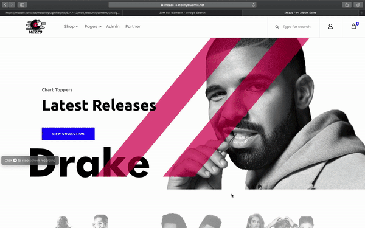
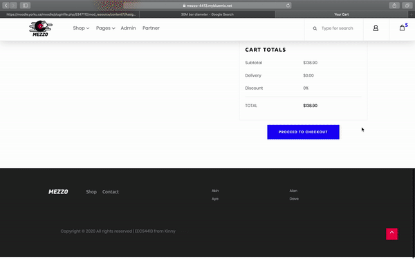

# Mezzo
EECS 4413 Final project -
Mezzo is the final term project for the York University EECS 4413 - Building E-Commerce Systems course. It is a RESTFUL music store built on Apache Tomcat and deployed on IBM cloud. It relies on a DB2 database managed by IBM cloud for pulling all site data from ALbums, Reviews Users etc for display on the website. 

This project is the child of Authors Aya Abu Allan, Alan Tang, Dong Jae Lee, and Akinloluwa Adewale

We hope you enjoy [Mezzo](https://mezzo-4413.mybluemix.net/) - #1 Album site!

## Built With

* [Apache Tomcat](http://tomcat.apache.org/) - Local Server 
* [DB2](https://www.ibm.com/cloud/db2-on-cloud/) - DBMS on cloud
* [IBM Cloud](https://www.ibm.com/cloud) - Hosting 
* [Eclipse Java EE](https://www.apachefriends.org/index.html) - Development

## Quick Preview
#### Part 1

#### Part 2


## How to Run
##### Clone Repository via Eclipse GIT
If you choose to clone the repository via eclipse, the main project is located as the 'testing_proj'. as soon as it is imported, eclipse will recognize this as a project. At this point, provided you have set up Apache Tomcat 8.5 correctly, you will need to  then set up your database Access.

In the [context.xml](https://github.com/AkinAD/Mezzo/blob/master/testng_proj/WebContent/META-INF/context.xml) file we have left the access credentials to access our CLoud DB,  however if you would prefer to run the  project locally, a [proj.sql](testng_proj/proj.sql) file has also been provided with the *early* stage version database of this project.

Next, alter your DAOs depending on how youintend on access the Database. Set the appropriate data source. if you ahve decided to use our cloud db, the options below will connect you to the database per the specified credentials in the [context.xml](testng_proj/WebContent/META-INF/context.xml)

```ds = (DataSource) (new InitialContext()).lookup("java:/comp/env/jdbc/Db2-4413"); // USE THIS TO DEBUG LOCALLY ```

If you have opted foy your own local database, simply replace the'DB2-4413' with your local database name.

At this point all should be set. Right click the main project 'testing_proj' and select run on server. the project should work as expected.

##### Import WAR file
Most of the steps listed above still apply for this configuration, database setup is still required so be sure to complete those steps.

## Testing - REST 
Instuctions were unclear about TESTING towards the final moments of the project deadline, we opted for a quick java class with two test methods and a utility method. To see the REST api calls in action, visit links below . For quick Documentation on REST for partners, visit [Mezzo Partner page](http://mezzo-4413.mybluemix.net/howToRest.jsp)

REST API testing - Visit here for information on the REST endpoints

Sample links: Orders - https://mezzo-4413.mybluemix.net/api/orders/?aid=1
Sample links: Products - https://mezzo-4413.mybluemix.net/api/products/1 


 
 ## Authors
* **Akin Adewale** - [akinAd](https://github.com/ayaAllan)

* **Alan Tang**  - [alanTang](https://github.com/domainabusers)

* **Aya Abu Allan**  - [ayaAllan](https://github.com/ayaAllan)

* **Dong Jae Lee**  - [Dave](https://github.com/cima369)
