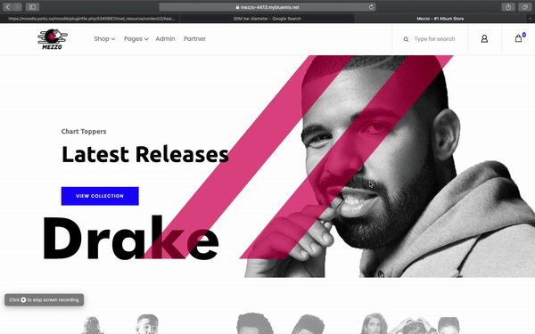

# Mezzo
EECS 4413 Final project -
Mezzo is the final term project for the York University EECS 4413 - Building E-Commerce Systems course. It is a RESTFUL music store built on Apache Tomcat and deployed on IBM cloud. It relies on a DB2 database managed by IBM cloud for pulling all site data from ALbums, Reviews Users etc for display on the website. 

This project is the child of Authors Aya Abu Allan, Alan Tang, Dong Jae Lee, and Akinloluwa Adewale

We hope you enjoy [Mezzo](https://mezzo-4413.mybluemix.net/) - #1 Album site!

## Built With

* [Apache Tomcat](http://tomcat.apache.org/) - Local Server 
* [DB2](https://www.ibm.com/cloud/db2-on-cloud/) - DBMS on cloud
* [IBM Cloud](https://www.ibm.com/cloud) - Hosting 
* [Eclipse Java EE](https://www.apachefriends.org/index.html) - Development

## Quick Preview

## Testing 

 blah 
 blah
 blah
 
 ## Authors
* **Akin Adewale** - [akinAd](https://github.com/ayaAllan)

* **Alan Tang**  - [alanTang](https://github.com/domainabusers)

* **Aya Abu Allan**  - [ayaAllan](https://github.com/ayaAllan)

* **Dong Jae Lee**  - [Dave](https://github.com/cima369)
